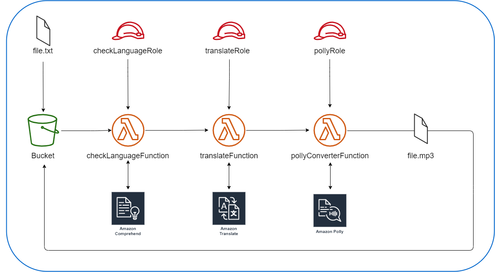

# GERMAN TRANSLATE PROJECT

## Overview
This project deploys a serverless backend feature to translate texts from Spanish into spoken German and from written german into spoken german, using AWS services.

This project has been developed for learning purposes.


## Architecture Diagram


Once the infrastructure is deployed using the CloudFormation template,
small texts can be uploaded into the bucket in (.txt) format to trigger the first lambda function.

After a while, a new file with the same name will pop up in the bucket with the speach in German (.mp3) format.

### Architecture Consideations

Three Lambda Functions have been developed instead of just one for various reasons:
- Keep each function simple.
- Learn and Showcase how to pass information from one lambda to the next one.
- Plan to include Step functions in this project in future versions.

Three Roles have been deployed to keep the principle of less privilege. 
Because this is just for training purposes,'FullAccess' policies have been used. 

## Usage

```hcl
# Must have programmatic access to AWS
git clone <REPOSITORY_URI>

cd <REPOSITORY_FOLDER>/cloudformation/

aws deploy --template-file GermanTranslate.yaml --stack-name<STACK-NAME>
```
